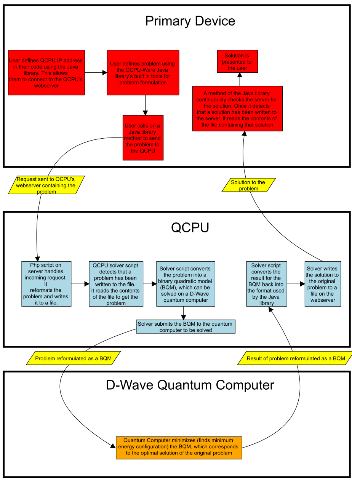
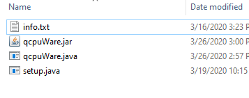

# Welcome to QCPU-Ware Documentation

## 1. Introduction
### 1.1 What is QCPU-Ware?
QCPU-Ware is software that allows users to solve problems on a quantum computer without needing to know anything about quantum computing.  QCPU-Ware is built on D-Wave Systems' Leap Ocean-SDK [D-Wave Leap](https://www.dwavesys.com/take-leap).  QCPU-Ware takes the Ocean-SDK and makes the entire development process much more user-friendly.  QCPU-Ware provides the user with simple and easy to use tools to formulate problems to be solved on the D-Wave quantum computers.  By using the QCPU-Ware Java library, users can define real-world problems to be solved on the D-Wave System like never before.  They can do all of this without needing to know anything about how quantum computing works.

### 1.2 What is a QCPU?
QCPU-Ware stands for "Quantum Converter Processing Unit softWare".  A Quantum Converter Processing Unit is a device that converts a problem specified by the user, into a problem that a quantum computer can solve.  The advantage of using a QCPU is that it allows the user to formulate problems without needing to know exactly how quantum computers work.  This also eliminates the need for the user to know how to formulate problems for the quantum computer.  This, in turn, makes coding on a quantum computer much easier, and available to people with any level of coding experience.   QCPU-Ware allows any Debian Linux based system (E.g. a [Raspberry Pi](https://www.raspberrypi.org/)) to be used as a QCPU.


## 2. How QCPU-Ware Works
### 2.1 QCPU
QCPU-Ware allows the user to set up a QCPU on any device running Debian based Linux (some popular debian based Linux distros are Ubuntu, Raspbian, Zorin os, and Kali Linux.  To get a complete list, see [Debian-based_distributions](https://en.wikipedia.org/wiki/Category:Debian-based_distributions)).  A QCPU can be set up on the same device that the QCPU-Ware Java Library is being used on, or it can be set up on a diferent device.  Both options are supported by QCPU-Ware, and it is the user's choice.  The device that the QCPU-Ware Java library is installed on is called the **primary device**.  When a QCPU is set up directly on the primary device, it is called an **internal QCPU**.  On the other hand, when a QCPU is set up on another external device, it is called an **external QCPU**.

### 2.2 Internal QCPU
Recall that QCPU-Ware only supports setting up QCPUs on devices running Debian based Linux.  If Debian based Linux is the main operating system on the primary device, then a QCPU can be set up directly on the device.  However, the primary device might not be running Debian based Linux as it's main os, as is often the case.  In this situation, an internal QCPU can still be set up, but inside of a Linux [virtual machine](https://en.wikipedia.org/wiki/Virtual_machine).

### 2.3 External QCPU
An external QCPU can be set up any any device running Debian based Linux, so long as it is connected to the same wifi network as the primary device.  There are many [single board computers](https://en.wikipedia.org/wiki/Single-board_computer) out there that are capable of running linux.  These computers are a great option for an external QCPU, because they are often very cheap.  The best option when it comes to single board external QCPUs is the [Raspberry Pi](https://www.raspberrypi.org/).

### 2.4 How QCPU-Ware Sets Up QCPUs to Handle Requests from the Java Library
When the QCPU-Ware QCPU setup script is run on a Linux device, it does 3 things:

**1.** It sets up an [Apache Webserver](https://httpd.apache.org) on the device, to which the Java library can send requests and access results.

**2.** It installs the QCPU software that alows the device to convert user formulated problems into problems that can be submitted to a quantum computer.  It also generates a script that makes the QCPU software run automatically when the device boots up.

**3.** It installs and sets up the D-Wave Ocean SDK on the device, allowing it to submit problems to a quantum computer and get the result back. 

Using the QCPU-Ware Java library, users specify the ip address of the QCPU.  This gives the primary device access to the QCPU's webserver, allowing it to submit problems and view the results.  Before they can submit problems to the QCPU, the user must formulate the problem using the Java library's built in problem formulation tools.  Once the problem has been formulated, the user can submit it to the QCPU using another built in function.  This function will send the problem as a request to the webserver.  A php script running on the webserver reformats the request and writes it to a file.  When the QCPU solvers detect that the file has been edited, it reads the contents of that file to get the problem.  The solver then converts the problem into a [binary quadratic model](https://docs.ocean.dwavesys.com/en/stable/concepts/bqm.html) (BQM), which is a type of function that can be minimized on a D-Wave quantum computer.  The problem is the  submitted to a quantum computer to be solved.  Once the QCPU gets the result back, it converts it back into the format used by the Java library, and writes it to a file on the webserver.  Once the Java library detects that the server has the solution, it reads the solution and presents it to the user.  This entire process takes mere seconds, and it greatly reduces the complexity of problem formulation on the user side.  The flow-chart below shows the process described above:



## 3. Installation and Setup
### 3.1 QCPU Setup
#### 3.1.1 Getting Started
Remember that whatever device you plan on using as your QCPU must be running Debian based Linux.  If you are going to be using an internal QCPU, and Linux is not your main operating system, you will need to set up a virtual machine.  These docs will not cover setting up a virtual machine, but you can see [this tutorial](https://brb.nci.nih.gov/seqtools/installUbuntu.html), or this [QCPU-Ware setup video](https://www.youtube.com/channel/UCNy6WfWTRKS4vya6KlD4Hxg) for more information.  If you plan on using an external QCPU, make sure that the external device has Debian based Linux set up on it.  If you are using a Raspberry Pi, see [this guide](https://www.raspberrypi.org/documentation/installation/installing-images/README.md) or the [QCPU-Ware setup video](https://www.youtube.com/channel/UCNy6WfWTRKS4vya6KlD4Hxg) for information on installing and setting up the operating system, [Raspbian](https://www.raspberrypi.org/documentation/raspbian/).

<iframe src="https://cogrpar.github.io/cogrpar.QCPUWare.github.io/imgs/Warning1.html" height="1600" width="1000" scrolling='yes' frameBorder="0" align="left" ></iframe>

QCPU-Ware includes a QCPU setup script that can be run on any Debian Linux device to set up a QCPU on that device.  Before you can clone the QCPU-Ware repository and run the setup script on a device, you need to make sure that the device has the proper tools installed to run the script.  The device will need [**git**](https://www.atlassian.com/git/tutorials/what-is-git) installed to clone the QCPU-Ware repository, and [**python3**](https://www.python.org/) (as well as [**python3-pip**](https://pip.pypa.io/en/stable/)) installed to run the script.  To install these programs, run this command on the device you will be using as your QCPU:
```
sudo apt-get update
sudo apt-get install git python3 python3-pip
```
When you run this command, the device will prompt you for the root password.  Some Debian Linux distros don't have a root password by default.  In that case, if you are promped for the root password, just type in the password of your current user.  For example, if you are using Ubuntu (which has no root password by default), and you are logged in as a user named "user" whose password is "password", you would type "password" when promped for the root password.  This will become important later when the setup script prompts you for the root password in order to run the QCPU-Ware QCPU solver scripts on boot.  For now, just make sure that the above command runs properly.  Once it has installed those tools, you should check that they have been installed successfully by running these 3 commands:
```
git --version
python3 --version
pip3 --version
```
If you get an output telling you the version for all three of these command, you are ready to move on.

#### 3.1.2 Cloning QCPU-Ware
There are two options for cloning the QCPU-Ware Github repository:

**1.** You can download the repo as a .zip file by clicking the "Download" button on the [QCPU-Ware Official Website](https://cogrpar.github.io/cogrpar.QCPUWare.github.io/):

Once the .zip file has finished downloading, extract the contents of the file to a directory that you can easily access.  You can do this through the File Viewer GUI, or by using this command:
```
unzip qcpuWARE-master.zip
```
Once the contents of the .zip file have been extracted, navigate into the new folder called "qcpuWARE-master" by using this command:
```
cd qcpuWARE-master
```

**2.** You can clone the repo directly using **git**.  To do that, navigate to the directory where you would like the repository to be cloned to, and run this command:
```
sudo git clone https://github.com/cogrpar/qcpuWARE.git
```
Once git has finished cloning the repo, navigate into the new direcory called "qcpuWARE" by using this command:
```
cd qcpuWARE
```

#### 3.1.2 Running the QCPU-Ware QCPU Setup Script
<iframe src="https://cogrpar.github.io/cogrpar.QCPUWare.github.io/imgs/Warning2.html" height="100" width="1000" scrolling='yes' frameBorder="0" align="left" ></iframe>

Once you have navigated into the repository directory ("qcpuWARE-master" if you downloaded the .zip file, and "qcpuWARE" if you used git), navigate into the "QCPU_Setup" directory by using this command:
```
cd QCPU_Setup
```
You can now execute the QCPU setup script using this command:
```
sudo python3 setup.py install
```
If you have already set up a QCPU on a device, and would like to update it, run the above command, but replace the "install" argument with an "update" argument.  If you are prompted for the root password, and you have a root password set up, then enter the root password and hit enter.  If you are prompted for the root password, and you do not have a root password, type in the password of the account that you are currently using and hit enter.  The setup script will start by installing an [Apache Webserver](https://httpd.apache.org) on your device (see [How QCPU-Ware Sets Up QCPUs to Handle Requests from the Java Library](https://cogrpar.github.io/cogrpar.QCPUWare.github.io/docs.html#24-how-qcpu-ware-sets-up-qcpus-to-handle-requests-from-the-java-library)).  If the script prompts you to give it permission to install the webserver, you must give it permission by typing "y" and then enter.  Next, the setup script will prompt you to create a password for the QCPU webserver:  
```
What would you like the server's password to be (optional): 
```
This is an optional setting, so you can either type in a password, or you can leave it blank and hit enter.  If you do set a password, you will need to use it in the QCPU-Ware Java library in order to access the QCPU.  Next, the setup script will prompt you for a username:
```
username:
```
This username should be the user that you are currently using, and the one that the "/home/(username)" directory is named after.  Type in your username and hit enter.  Next, you will be asked if you are using an ARM based device (which is often the case if you are using a single-board external QCPU, i.e. a Raspberry Pi):
```
Are you using a raspberry pi or other device with similar architecture (ARM based)? (y = yes, n = no):
```
The setup script needs this information in order to know how to install the [D-Wave Ocean SDK](https://github.com/dwavesystems/dwave-ocean-sdk) on your QCPU.  In order to install the SDK on an ARM based device, it must build the SDK directly on the device, whereas on other architectures, it can simply use [python3-pip](https://pip.pypa.io/en/stable/).  If you are using an ARM based device, type "y" into this field.  Otherwise, type "n".  Hit enter.  Next, the script will ask for your root password:
```
root password:
```
It needs the root password to tell the QCPU to start the QCPU-Ware solvers automatically when the device boots up.  As mentioned earlier, if you have no root password on your device, type in the password of the user that you are currently using.  For example, if you are using Ubuntu (which has no root password by default), and you are logged in as a user named "user" whose password is "password", you would type "password" when promped for the root password.  If you do have a root password, type it in and hit enter.  The setup script has now finished installing the QCPU-Ware QCPU solvers on your QCPU.  Now, the only thing that it needs to do, is to gather your D-Wave Leap account information on the QCPU.  It needs this info to access the quantum computers.  When the script does this, it will prompt you for all of your account information.  It stores this infomation using the ```dwave config create``` command built into the D-Wave Ocean SDK.  The instructions for how to fill out the fields for this command are below, but you can get more information in the [the D-Wave Docs](https://docs.ocean.dwavesys.com/en/stable/overview/sapi.html).  You should see the following text once the setup script is ready to start asking for your D-Wave Leap account information:
```
Time to input your dwave leap account info; if you are not sure how to fill out these fields, please refer to https://docs.ocean.dwavesys.com/en/stable/overview/sapi.html
Configuration file not found; the default location is: /home/(user)/.config/dwave/dwave.conf
Confirm configuration file path [/home/(user)/.config/dwave/dwave.conf]:
```
This is asking you where you would like it to store the configuration file contaning your D-Wave Leap account information.  Leave the setting as default by hitting enter.  Next, you should this:
```
Profile (create new) [prod]:
```
Once again, you will want to leave this as default, so just hit enter.  Next, you should see this:
```
API endpoint URL [skip]:
```
This is asking for the API endpoint URL to access the D-Wave system.  Use this url: ```https://cloud.dwavesys.com/sapi```.  Once you have coppied the url in, hit enter.  You should now see this:
```
Authentication token [skip]:
```
Each D-Wave Leap account has a unique authentication token generated for it.  By using your account authentucation token, the QCPU can access the quantum computers with your Leap account, without needing to store your account username or password.  To get your authentication token, you will want to go to your [D-Wave Leap Account Dashboard](https://cloud.dwavesys.com/leap/).  Log in with your Leap account, and scroll until you see a text box on the left side of the screen that says: "API Token"; click on the "copy" button to copy the token to your clipboard:

Once you have copied the token to your clipboard, paste it into the setup script terminal window.  Once you have input your API token into the setup script, hit enter.  Next, you should see this:
```
Default client class (qpu or sw) [qpu]:
```
You will want to leave this setting as default, so hit enter.  Next, you should see this:
```
Default solver [skip]:
```
This is the setting that the QCPU will use to determine what device it will send the problems to.  You will need to type in the name of the quantum computer that your D-Wave Leap account has access to.  To get the name of this solver, go back to your [D-Wave Leap Account Dashboard](https://cloud.dwavesys.com/leap/).  Scroll all the way to the bottom, untill you see the text box that says "Supported Solvers"; look under "Solvers", and under "QPU".  This is the name of the quantum computer that you have access to:

Copy this solver name, and paste it into the setup script terminal window.  Once you have inserted the solver name, hit enter.  The setup script now has all of the information it needs to access a D-Wave quantum computer.  Your configuration should be saved, and you should see:
```
Configuration saved.
```
The last thing that the setup script will do, is ping the D-Wave quantum computer using the ```dwave ping``` command.  If the ping is successful, you should see an output similar to this:
```
Using endpoint: https://cloud.dwavesys.com/sapi
Using solver: (your solver name)
Submitted problem ID: 874c2706-0edb-4627-bc6f-b5c6d94dc0f7

Wall clock time:
 * Solver definition fetch: 659.668 ms
 * Problem submit and results fetch: 1877.596 ms
 * Total: 2537.264 ms

QPU timing:
 * qpu_sampling_time = 315 us
 * qpu_anneal_time_per_sample = 20 us
 * qpu_readout_time_per_sample = 274 us
 * qpu_access_time = 9696 us
 * qpu_access_overhead_time = 1896 us
 * qpu_programming_time = 9382 us
 * qpu_delay_time_per_sample = 21 us
 * total_post_processing_time = 54 us
 * post_processing_overhead_time = 54 us
 * total_real_time = 9696 us
 * run_time_chip = 315 us
 * anneal_time_per_run = 20 us
 * readout_time_per_run = 274 us
setup complete
```
If you get this output, the setup script has completed successfully, and you are ready to start using your QCPU!  Your QCPU should now be set up to start running the QCPU-Ware QCPU solvers whenever it boots up.  For more information on connecting to your QCPU using the Java library, see [Connecting to Your QCPU](https://cogrpar.github.io/cogrpar.QCPUWare.github.io/docs.html#5-connecting-to-your-qcpu).

### 3.2 Installing the QCPU-Ware Java Library

In order to install the QCPU-Ware Java library on your primary device, you will need to clone the QCPU-Ware github repo on the primary device.  Once again, here are the two options for cloning the QCPU-Ware Github repository:

**1.** You can download the repo as a .zip file by clicking the "Download" button on the [QCPU-Ware Official Website](https://cogrpar.github.io/cogrpar.QCPUWare.github.io/):

Once the .zip file has finished downloading, extract the contents of the file to a directory that you can easily access.  Once the contents of the .zip file have been extracted, navigate into the new folder called "qcpuWARE-master", either in a file viewer GUI, or by using this command:
```
cd qcpuWARE-master
```

**2.** You can clone the repo directly using **git** (of course if you decide to use this method, you must make sure that git is installed on your primary device.  You can acces the download page [here](https://git-scm.com/downloads)).  To do that, navigate to the directory where you would like the repository to be cloned to, and run this command:
```
git clone https://github.com/cogrpar/qcpuWARE.git
```
Once git has finished cloning the repo, navigate into the new direcory called "qcpuWARE", either in a file viewer GUI, or by using this command:
```
cd qcpuWARE
```
Once the repository is cloned on the primary device, navigate into the directory containing the Java library, either in a file viewer GUI, or by using this command:
```
cd JavaLibrary
```
Inside of this directory, you should see the Java library as both a .jar file, and as a .java file: 


Some Java IDEs, such as [Eclipse](https://www.eclipse.org/eclipseide/) have the option to add a Java library in the form of a .jar file.  If you are using an IDE that supports this,  you can use that option to add the QCPU-Ware Java library .jar file to your project.  See [this](https://www.java67.com/2017/04/how-to-add-jar-file-in-eclipse-project.html) tutorial for adding .jar files to Eclipse projects.  If you are using an IDE that does not support adding external .jar files, or if you are not using an IDE, you can either manually add the .jar file to the Java classpath (see [this](https://howtodoinjava.com/java/basics/java-classpath/) tutorial), or you can just copy the .java file into your project directory.  Once you have added the QCPU-Ware Java library to your project using one of the above methods, you can test to make sure that you can use it in your code by creating a new instance of the library in your main method.  For example, if your project class is called "myClass", then your code should look like this:
``` java
//import statement up here if needed (see https://www.geeksforgeeks.org/packages-in-java/ for more info about "import" in java)

class myClass{
  //main method
  public static void Main (String[] args){
    //create a new instance of the qcpuWare Java library and call it qcpu:
    qcpuWare qcpu = new qcpuWare();
  }
}
```
If you can run this code without errors, then the QCPU-Ware Java library is set up on your primary device, and you are ready to start solving problems using QCPU-Ware.


## 4. What Types of Problems Can You Solve With QCPU-Ware?
QCPU-Ware can be used to submit problems to a D-Wave quantum computer to be solved.  D-Wave quantum computers are a special kind of quantum computer called a [**Quantum Annealer**](https://docs.dwavesys.com/docs/latest/c_gs_2.html).  You can learn more about quantum annealing in the D-Wave system documentation, or you can watch [this video](https://www.youtube.com/watch?v=zvfkXjzzYOo) which sums the process up pretty well.  The goal of QCPU-Ware is to make coding on a quantum computer straightforward.  This means that a knowledge of how quantum computers work or how they solve problems is not necessary.  That being said, the process is explained briefly below.  It is not necessary to read that section (although it is helpful if you want), but it is recommended that you read the section after it, [Optimization Problems that Can be Submitted Through QCPU-Ware](https://cogrpar.github.io/cogrpar.QCPUWare.github.io/docs.html#42-optimization-problems-that-can-be-submitted-through-qcpu-ware), as it contains information that will help with the problem defining process.

### 4.1 How Quantum Annealers Work, and How They Solve Problems
Quantum annealers, like the ones built by D-Wave (the ones used by QCPU-Ware), are a special kind of quantum computer.  They are simpler than an ordinary [universal quantum computer](https://www.youtube.com/watch?v=2B680d-qvhI&t=24s), and that makes them easier to create in the real world.  Quantum annealers take advantage of a fundamental law of nature: a system will always collapse into the lowest energy state.  Essentially, a quantum annealer encodes a problem onto a set of q-bits and then lets the q-bits collapse into the lowest possible energy state.  In this way, a quantum annealer can find the smallest possible configuration of all of the variables in the problem.  This is useful because it allows quantum annealers to solve problems known as  [**optimization problems**](https://en.wikipedia.org/wiki/Optimization_problem).  Optimization problems are problems that involve many different variables, and the goal is to find the configuration of all of the variables that makes the result as big or as small as possible.  For example, imagine this scenario: a person is going house to house to sell some form of food for a fundraiser.  Every house will buy a different quantity of the food item, and each house will take a certain amount of time to get to.  The person wants to know what houses they should go to, to sell all of the food items as fast as possible, considering both how long it takes to get to each house, and how much each house will purchase.  In this example, solving the optimization problem means finding the configuration of the variables (which houses should be visited) which will minimize the amount of time that it would take to sell all of the food (or if you want to look at it as a maximization problem, the goal would be to maximize efficiency).  Optimization problems show up all of the time in computer science and beyond.  Being able to solve them is extremely useful, but for classical computers, it is extremely difficult.  That is because classical computers must go through every single configuration of the variables to see if it is the best possible configuration.  For problems with many variables, there are essentially an infinite number of possible configurations (at least the number is too great for a classical computer to check in any realistic amount of time), which means that classical computers can't solve most reasonable complex optimization problems.  Quantum annealers, however, are quite efficient at solving optimization problems.  By encoding the problem on a set of q-bits, the annealer can let the q-bits naturally collapse into the lowest energy state, which corresponds to the optimal configuration of all of the variables.  This allows quantum annealers to solve optimization problems much faster than classical computers.

### 4.2 Optimization Problems that Can be Submitted Through QCPU-Ware
QCPU-Ware uses the quantum annealers built by D-Wave Systems to solve optimization problems.  These quantum annealers have up to 5000 q-bits, but the technology is still in its early stages.  Even so, QCPU-Ware can be used to easily define and solve fairly complex and useful optimization problems on the quantum computers.  As of right now, QCPU-Ware has built-in tools to solve two kinds of optimization problems.

**1.  Binary Constraint Satisfaction Problems (BCSP):**

The first kind of optimization problem that can be solved with QCPU-Ware is **binary constraint satisfaction problems** or **BCSPs**.  As the name suggests, BCSPs are problems that involve binary variables, meaning that they can be in one of two states: 0 or 1.  These variables can be used to represent real-life situations that can be in one of two states.  For example, a variable could be used to store whether a person is a male or female, if a store is open or closed, or if it is day or night.  Binary constraint satisfaction problems are defined by specifying one or more constraints about the set of binary variables.  These constraints can involve any number of variables, and they place limits on what states that the variables can be in, and what states they can be in with relation to each other.  For example, there could be a constraint saying: "If it is night, then the store is closed, and if it is day, then the store is open".  Once all of the constraints have been specified, the goal is to find the configuration of all of the binary variables that satisfy as many of the constraints as possible.  This is how the BCSP is solved.  In our example with the two variables (day/night and store open/closed), and with the single constraint ("If it is night, then the store is closed, and if it is day, then the store is open"), then the two possible solutions to the BCSP: "day and open", or "night and closed".  This boolean truth table represents the example BCSP (note that table formatting may be incorrect on mobile devices):
```
Variables: time (day/night), shop (open/closed)
Constraints: “If it is night, then the store is closed, and if it is day, then the store is open”
```

| Variable Configuration                | Number of Constraints Satisfied |
|---------------------------------------|---------------------------------|
| ```time = day and store = open```     | 1                               |
| ```time = day and store = closed```   | 0                               |
| ```time = night and store = open```   | 0                               |
| ```time = night and store = closed``` | 1                               |

BCSPs with many variables are extremely difficult to solve on a classical computer, but they can be solved using QCPU-Ware.  To learn more about BCSPs, see the [D-Wave docs](https://docs.ocean.dwavesys.com/en/stable/concepts/csp.html)

**2.  Function Extremes:** 

The second kind of optimization problem that can be solved with QCPU-Ware is called **function extremes**.  Imagine that you have an n-dimensional function, f(x1, x2, ... xn).  This function can model anything and the variables can be any value within a given domain.  Solving for the function extremes of f(x1, x2, ... xn) means solving for the configuration of all of the variable that yields the maximum or minimum value of the function.  For example, if f models cost, and it is based on variables like the number of employees, the salary of each employee, and such, then finding the minimum function extreme of f would correspond to finding the lowest cost in our situation.  If f(x1, x2, ... xn) makes a curve in (n+1)-dimensional space, then solving the function extreme means finding the point on the curve with the highest or lowest altitude:


There are many useful applications for finding the function extremes of various types of functions, and QCPU-Ware gives you the ability to solve for those function extremes.

## 5. Connecting to Your QCPU
### 5.1 QCPU IP Address Using the SetQcpuIP Method
The first thing that you will need to establish a connection between your QCPU and the QCPU-Ware Java library is your QCPU's IP address.  In most situations, this will be the private IP address, and in order for the connection to work, both the QCPU and the primary device must be on the same network.  If you would like the primary device and the QCPU to be on different networks, you must [set up port forwarding on your router](https://stackoverflow.com/questions/22730420/how-to-configure-apache-webserver-to-be-accessed-by-public-domain-or-static-ip), and use your QCPU's public IP.

#### 5.1.1 How to Get QCPU IP Address 
To get your QCPU's private IP address, open up a terminal on it and type in the following command:
```
hostname -I
```
The output should look something like ```192.168.1.1``` or ```10.0.0.1```.  If you have set up port forwarding and plan on using the public IP, you can use a site such as https://whatismyipaddress.com/ to get it.
<iframe src="https://cogrpar.github.io/cogrpar.QCPUWare.github.io/imgs/Warning3.html" height="110" width="1000" scrolling='yes' frameBorder="0" align="left" ></iframe>

#### 5.1.2 Using the SetQcpuIP Method to Set QCPU IP Address in the Java Library
Once you have found your QCPU's IP address, you will need to use the ```SetQcpuIP``` method within the Java library to specify the address so that the library can submit problems to the QCPU.  Here is a basic rundown of the method and it's parameters:
```java
qcpuWare.SetQcpuIP(String ip);
```
To use the method, simply insert the above line somewhere in your code, where the ```ip``` parameter is the QCPU IP address as a string, eg. ```"192.168.1.1"```.

### 5.2 QCPU Server Password Using the SetQcpuPw Method
This step only applies if you set a QCPU server password (see [above](https://cogrpar.github.io/cogrpar.QCPUWare.github.io/docs.html#312-running-the-qcpu-ware-qcpu-setup-script) for details).  If you did not set a server password, then you can skip this section.  A server password must be specified in order for the QCPU-Ware Java library to have access to your QCPU.  This can be done using the ```SetQcpuPw``` method.  Here is a basic rundown of the method and it's parameters:
```java
qcpuWare.SetQcpuPw(String pw);
```
To use the method, simply insert the above line somewhere in your code, where the ```pw``` parameter is your QCPU's server password as a string, eg. ```password```.

### 5.3 Example Code
In this example code, a new instance of the QCPU-Ware Java library is created (called qcpu).  Also, the SetQcpuIP and SetQcpuPw methods are used to specify the QCPU IP address and server password (for example's sake, the IP is ```"192.168.1.1"```, and the password is ```password```):
``` java
//import statement up here if needed (see https://www.geeksforgeeks.org/packages-in-java/ for more info about "import" in java)

class myClass{
  //main method
  public static void Main (String[] args){
    //create a new instance of the qcpuWare Java library and call it qcpu:
    qcpuWare qcpu = new qcpuWare();
    //specify the QCPU IP address using the SetQcpuIP method
    qcpu.SetQcpuIP("192.168.1.1");
    //specify the QCPU server password using the SetQcpuPw method
    qcpu.SetQcpuPw("password");
  }
}
```


## 6. Solving Binary Constraint Satisfaction Problems
QCPU-Ware can be used to solve [binary constraint satisfaction problems (BCSPs)](https://cogrpar.github.io/cogrpar.QCPUWare.github.io/docs.html#42-optimization-problems-that-can-be-submitted-through-qcpu-ware).  To formulate the problem, the user must first declare the **problem string**.  In order for the QCPU to be able to interpret the problem specified by the user, the entire problem is encoded in a single string called the problem string.  The process of constructing the problem string is made simple through the tools included in the QCPU-Ware java library.  For BCSPs, the problem string is structured like this:
```
1. QCPU Solver Mode (BCSP in this case)
2. Constraints 
3. The Number of Binary Variables
```
To formulate the BCSP, first declare the problem string.  The problem string is just like any other string in Java, and it can be declared like:
```java
String problemStr = ""; //Note you must also initiate the string (using = "" ), otherwise the problem def tools won't be able to append anthing to the problem string
```
Where the problem string is called problemStr.  Once the problem string has been declared and initiated, the rest of the problem can be encoded on the string.  The order of how the problem data is added to the problem string is extremly important, and if information is added to the string in the wrong order, then the QCPU will not be able to solve the problem.  First, the solver mode must be specified.  This can be done using the ```ModeSet``` method.  This method returns a string that can be appended to the end of the problem string.  To set the mode to BCSP, and to update the problem string, the following line can be used (once again, where the problem string is called problemStr):
```java
problemStr += qcpuWare.ModeSet("BCSP");
```
Once the mode has been set to BCSP, the constraints of the problem must be specified.  To define your constraints, you will want to begin by actually figure out how many variables you will be using, and what your constraints will be.  Once you have these two things, you will want to create an integer that has a value of how many variables you are using.  You will also want to declare a new string array that will store the constraints.  For this reason, the length of the array should be the number of constraints you are using.  If you want to solve a problem with 5 variables, and 3 constraints, then your code should look like this:
```java
int numOfVars = 5; //problem with 5 variables
String[] constraints = new String[3] //problem with 3 constraints
```
Now assign the constraints from your problem to the members of the string array.  Each constraint should be a boolean statement (or a statement that can either be true or false.  As for the syntax of the constraints, each binary variable's name must be of the form ```vN``` where N is some value between 0 and the number of variables - 1, ie. ```v0, v1 ... vN```.  Along with the binary variables, constraints can also be made up of these symbols:
```
== -> equal to
!= -> not equal to
<, >, <=, >=, -> less than, greater than, less than or equal to, greater than or equal to.
and -> and
or -> or
not -> not
numbers and operations (+, -. *, /) can be used as well
```
Constraints can be made up of the binary variables and the above symbols.  Once you know your constraints, you can assign them to the members of the constraints array (as strings).  For example, something like:
```java
constraints[0] = "constraint #1"
constraints[1] = "constraint #2"
constraints[2] = "constraint #3"
constraints[3] = "constraint #4"
constraints[4] = "constraint #5"
```
(Replacing "constraint #n with an actual constraint, still in the form of a string).  Once all of the constraints have been defined, you can add the constraints and the number of variables to the problem string using the ```ConstSet``` method:
```java
problemStr += qcpuWare.ConstSet(constraints, numOfVars);
```
The problem string is now complete, and the problem has been defined.  It is time to send the problem string to your QCPU so that it can be solved on a quantum computer.  Submitting the problem and getting the result back as an array is all done using a single method: ```SendToQCPU```.  This method returns the solution to the problem as an array of doubles.  If your problem string is called ```problemStr```, and the solution array is called ```solution```, then to submitting the problem and getting the result could be done using this line:
```java
double[] solution = qcpuWare.SendToQCPU(problemStr);
```
Once the solution array has been returned, it can be used in your code.  For example, here is a simple bit of code that loops over the array, displaying the solution to the user:
```java
//print results all nice and pretty
for (int i = 0; i < solution.length; i++){
  System.out.println("v" + i + " ≈ " + solution[i]);
}
```

### 6.1 Solving BCSP Using QCPU-Ware Example: Doctor's Office
This is an example of a BCSP and how it can be solved using QCPU-Ware.  Imagine a doctor's office with two patient waiting rooms: a sick patient room, and a healthy patient room.  Here are the rules: if a patient is sick, then they must wait in the sick room, but healthy patients can wait in either room.  No more than 15 people can wait in the sick waiting room at any given time, and there will be no check-ups with healthy patients if there are over 10 sick patients.  We can create a set of constraints that fully capture these rules, eg:

**Constraint #1: sick patients must wait in the sick patients room and healthy patients can wait in either room**

**Constraint #2: no more than 15 patients in the sick patients room**

**Constraint #3: no check-ups with healthy patients if there are over 10 sick patients**

Once we have these constraints, we can formally define our binary variables, based on the information in the constraints:
```
health: 0 if you are healthy and 1 if you are sick
room: 0 for healthy room, and 1 for sick room
maxSickCapacity: 0 if < 15 people in the sick room (not including you), and 1 if there are 15 sick patients (not including you)
maxSickPatients: 0 if < 10 sick patients (not including you), and 1 if there are 10 sick patients (not including you)
```
Now that we have formally defined the binary variables, we can rewrite each constraint using the variables and allowed syntax (see above):
```java
Constraint #1: "health * room == health"
Constraint #2: "maxSickCapacity * health == 0"
Constraint #3: "maxSickPatients * health == 0"
```
Now that we have defined our variables and constraints, we need to reformat the variables before we can plug the problem into QCPU-Ware.  Remember variables must be renamed v0, v1 ... vn for however many variables you have.  We can rename the variables like this:
```java
health: "v0"
room: "v1"
maxSickCapacity: "v2"
maxSickPatients: "v3"
```
Using the new variable names, the constraints become:
```java
Constraint #1: "v0 * v1 == v0"
Constraint #2: "v2 * v0 == 0"
Constraint #3: "v3 * v0 == 0"
```
We can now solve this example BCSP by using QCPU-Ware Java library as follows:
First create a new instance of the library called qcpu, create the problem string, plug in the QCPU connection parameters (IP and password), and set the solver mode to BCSP:
```java
qcpuWare qcpu = new qcpuWare(); //create instance of library
qcpu.SetQcpuIP("192.168.1.1"); //connection info
qcpu.SetQcpuPw("password");

String problemStr = ""; //create problem string
problemStr += qcpu.ModeSet("BCSP"); //set mode to BCSP
```
Now we can create an int to store the number of variables, and we can declare and fill out the constraints array:
```java
int numOfVars = 4; //4 variables
String[] constraints = new String[3]; //declare array to store our 3 constraints
constraints[0] = "v0 * v1 == v0"; //fill out the constraints
constraints[1] = "v2 * v0 == 0";
constraints[2] = "v3 * v0 == 0"; 
```
Now we can add the constraints to the problem string:
```java
problemStr += qcpu.ConstSet(constraints, numOfVars);
```
Finally, we can submit the problem to be solved, and print the results to the user:
```java
double[] solution = qcpuWare.SendToQCPU(problemStr); //submit problem to QCPU to be solved and get result back as an array
//print results all nice and pretty
for (int i = 0; i < solution.length; i++){
  System.out.println("v" + i + " ≈ " + solution[i]);
}
```
That is it!  Here is the complete code:
```java
class DoctorsOffice{
  public static void main (String[] args){
    qcpuWare qcpu = new qcpuWare(); //create instance of library
    qcpu.SetQcpuIP("192.168.1.1"); //connection info
    qcpu.SetQcpuPw("password");

    String problemStr = ""; //create problem string
    problemStr += qcpu.ModeSet("BCSP"); //set mode to BCSP
    
    int numOfVars = 4; //4 variables
    String[] constraints = new String[3]; //declare array to store our 3 constraints
    constraints[0] = "v0 * v1 == v0"; //fill out the constraints
    constraints[1] = "v2 * v0 == 0";
    constraints[2] = "v3 * v0 == 0"; 
    
    problemStr += qcpu.ConstSet(constraints, numOfVars);
    
    double[] solution = qcpuWare.SendToQCPU(problemStr); //submit problem to QCPU to be solved and get result back as an array
    //print results all nice and pretty
    for (int i = 0; i < solution.length; i++){
      System.out.println("v" + i + " ≈ " + solution[i]);
    }
  }
}
```
When this program is run, it should output a valid solution that satisfies all of the constraints (there are more than one solution, so you could get one of several results).  The chart below presents all solutions, valid or not, as well as the number of constraints that they satisfy:

| Variable Configuration | Number of Constraints Met | Valid |
|------------------------|---------------------------|-------|
| 0000                   | 3                         | Yes   |
| 0001                   | 3                         | Yes   |
| 0010                   | 3                         | Yes   |
| 0100                   | 3                         | Yes   |
| 1000                   | 2                         | No    |
| 0011                   | 3                         | Yes   |
| 0110                   | 3                         | Yes   |
| 1100                   | 3                         | Yes   |
| 0101                   | 3                         | Yes   |
| 1010                   | 1                         | No    |
| 1001                   | 1                         | No    |
| 0111                   | 3                         | Yes   |
| 1110                   | 2                         | No    |
| 1011                   | 0                         | No    |
| 1101                   | 2                         | No    |
| 1111                   | 1                         | No    |

This example problem is simple, and we can simply look on the chart for the solutions, rather than going to all of the trouble of running the above code, but this is only an example.  There are many more useful and complex BCSPs out there, many of which can't be easily made into a truth table like the one above.  QCPU-Ware can be used to solve them on a quantum computer.


## 7. Solving For Function Extremes 
QCPU-Ware can be used to solve for [function extremes](https://cogrpar.github.io/cogrpar.QCPUWare.github.io/docs.html#42-optimization-problems-that-can-be-submitted-through-qcpu-ware).  To formulate the problem, the user must first declare the **problem string**.  In order for the QCPU to be able to interpret the problem specified by the user, the entire problem is encoded in a single string called the problem string.  The process of constructing the problem string is made simple through the tools included in the QCPU-Ware java library.  For function extremes, the problem string is structured like this:
```
1. QCPU Solver Mode (funcExtreme in this case)
2. Domain of Each Variable (Domains must be between 0 and some positive value)
3. The Function Itself
4. A Min/Max Boolean that Tells the QCPU if We Want To Find the Highest or Lowest Extreme
```
To formulate the Function Extreme Problem, first declare the problem string.  The problem string is just like any other string in Java, and it can be declared like:
```java
String problemStr = ""; //Note you must also initiate the string (using = "" ), otherwise the problem def tools won't be able to append anthing to the problem string
```
Where the problem string is called problemStr.  Once the problem string has been declared and initiated, the rest of the problem can be encoded on the string.  The order of how the problem data is added to the problem string is extremly important, and if information is added to the string in the wrong order, then the QCPU will not be able to solve the problem.  First, the solver mode must be specified.  This can be done using the ```ModeSet``` method.  This method returns a string that can be appended to the end of the problem string.  To set the mode to funcExtreme, and to update the problem string, the following line can be used (once again, where the problem string is called problemStr):
```java
problemStr += qcpuWare.ModeSet("funcExtreme");
```
Once the solver mode has been set to funcExtreme, the variable domains must be declared.  In function extreme problems, each variable must have a finite domain in order for the problem to have a definite solution.  In order for the problem to be defined in the QCPU-Ware Java library, each domain must be between 0 and some positive number.  This does not prevent the use of negative variable values, as variables can be subtracted in the actual function, but rather it makes the defenition of variable domains simpler.  Because the lower bound of every variable domain is 0, then the user must only specify the upper bound of each domain.  To specify the variable domains in the Java library, you must create an array of double values representing the upper bound of each domain.  This array of doubles is then passed into the ```DomainSet``` method which adds the domains to the problem string.  Here is an example of this process for a function with 4 variables:
```java
double[] domain = new double[4]; //create a double array to store the domains of 4 variables
domain[0] = upper bound of the domain of variable 1; //plugging in the upper bound of each variable's domain
domain[1] = upper bound of the domain of variable 2;
domain[2] = upper bound of the domain of variable 3;
domain[3] = upper bound of the domain of variable 4;

problemStr += qcpuWare.DomainSet(domain); //add the domains to the problem string using the DomainSet method
```
Once the variable domains have been added to the problem string, the function itself can be defined.  Here are the rules for what functions can contain:
1. Varaibles must be named v0, v1 ... vN for however many variables you have
2. The supported operations are +, -, and * (division is not suported for a technical reason: in order for the function to be run on a quantum annealer, it must be converted into a binary function called a binary quadratic model (BQM).  Functions containing division can not really be converted into BQMs, so they can not be reliably manipulated by quantum annealers)
3. Parentheses are supported and can be placed around terms so long as they are balanced
4. Constants and coefficients can be used in the functions
5. Every variable, opperation sign, constant and coefficient must be separated by a space

Using the rules above, you can define your function as a string.  At this point, you will also want to decide if you want to find the maximum or minimum extreme of the function.  This is stored in a binary variable (true for maximum and false for minimum).  Here is an example of defining a random function with 4 variables, and the min/max boolean, which will be set to true (for maximum):
```java
String function = "2 * v0 - (v1 + v2) - 0.1 * v3 * v0"; //this is the function to be min/maximized
boolean max = true; //this is the min/max boolean, set to true for maximum
```
Once the function and the min/max boolean have been defined, then they can be appended to the problem string using the ```FunctionSet``` method:
```java
problemStr += qcpuWare.FunctionSet(function, max);
```
Now that the problem is fully defined, it can be submitted to a QCPU to be solved using the ```SendToQCPU``` method.  This method returns the solution to the problem as an array of doubles.  If your problem string is called ```problemStr```, and the solution array is called ```solution```, then to submitting the problem and getting the result could be done using this line:
```java
double[] solution = new double[4];
solution = qcpuWare.SendToQCPU(problemStr);
```
Once the solution array has been returned, it can be used in your code.  For example, here is a simple bit of code that loops over the array, displaying the solution to the user:
```java
//print results all nice and pretty
for (int i = 0; i < solution.length; i++){
  System.out.println("v" + i + " ≈ " + solution[i]);
}
```

### 7.1 Solving For Function Extremes Using QCPU-Ware Example: 6 Friends
This is an example of a function extreme problem, and how it can be solved using QCPU-Ware.  Imagine that you are having a party with 6 of your friends.  You will need to buy several items for the party.  Those items are: 

**1. Party Hats (1$ each)**

**2. Gift Baskets (5$ each)**

**3. Icecream (4$ each)**

**4. Cake Slices (7$ each)**

The prices of each of those items are listed above.  Imagine that you know how many of your friends want each item:

**3 of your friends want party hats**

**6 of your friends want gift baskets**

**2 of your friends want icecream cones**

**5 of your friends want cake slices**

We can model this situation using a function.  In this function, the variables represent how many of each item you buy, ie. H = number of party hats, G = number of gift baskets, I = number of icecream cones, and C = number of cake slices.  The function itself represents the total price of all of the goods that you have purchased.  We can get the price by multiplying the price of each item, by the value of the cooresponding variable (or the quantity of that item).  For example, the function of price in this situation could be:
```
Price(H, G, I, C) = (1$ * H) + (5$ * G) + (4$ * I) + (7$ * C)
```
The values of the variables themselves can be any integer value.  However, based on the number of friends that want each item, we do have a lower limit for the number of each item.  That is because if we got less of an item than this lower limit, then we won't have eneugh for each friend.  We can use these values to define the domains of each of these variables:

**Domain(H) = [3, infinity)**

**Domain(G) = [6, infinity)**

**Domain(I) = [2, infinity)**

**Domain(C) = [5, infinity)**

Now that we have a function (```Price```) to model our situation, we can use it to find the configuration of all of the variables that will minimize ```Price```.  Right now, the function is simple eneugh to solve without the help of QCPU-Ware: we simply set the value of each variable to the lower limit of its domain.  By doing this, we can find the minimum price configuration:
```
MinConfig: H = 3, G = 6, I = 2, C = 5
```
This is our answer to the function extreme problem, but this is not a very good example, because we didn't even use QCPU-Ware to solve it.  We can make the situation more complicated, however, by introducing coupons.  These coupons will change the prices of certain items depending on the quantities of other items that you purchase.  Lets imagine that you have the following coupons:

**1. Square the difference in party hats and gift baskets and subtract that value from the total price (limited to 15 party hats)**

**2. Cube the difference in gift baskets and icecream cones and subtract that value from the total price (limited to 12 baskets)**

These coupons add a new component to our function of price.  Ie. we can add this term:
```
- (H - G)^2 - (G - I)^3
```
to our function.  Doing this results in the following function of price:
```
Price(H, G, I, C) = (1$ * H) + (5$ * G) + (4$ * I) + (7$ * C) - (H - G)^2 - (G - I)^3
```
The reason for adding the coupons was to make our function more complex, and something that can't easily be minimized in our heads.  Now that we have our function, we can rewrite it in such a way that it can be used in the QCPU-Ware Java library.  First of all, we need to expand the polynomial terms (the ones with ^2 and ^3), because exponents are not allowed when defining the problem.  Expanding the polynomials will give us:
```
Price(H, G, I, C) = (1$ * H) + (5$ * G) + (4$ * I) + (7$ * C) - (H * H) + (2 * H * G) - (G * G) - (G * G * G) + (3 * G * G * I) - (3 * G * I * I) + (I * I * I)
```
Now we need to rename the variables using the proper naming process.  Remember that the first variable must be v0, the second must be v1, and so on.  In this example, we can rename the variables like this:
```
H = v0
G = v1
I = v2
C = v3
```
Plugging these into the function gives us:
```
Price(v0, v1, v2, v3) = (1 * v0) + (5 * v1) + (4 * v2) + (7 * v3) - (v0 * v0) + (2 * v0 * v1) - (v1 * v1) - (v1 * v1 * v1) + (3 * v1 * v1 * v2) - (3 * v1 * v2 * v2) + (v2 * v2 * v2)
```
Now we need to look at our variable domains.  In order for the QCPU-Ware function extreme solvers to work, the variables must have finite domains.  Right now, our variables actually have infinite domains, because they have no upper limit.  We will need to set an arbitrary upper bound for each of the variable domains.  In other words, we need to estimate an upper limit for each of the variable domains.  The upper bounds should be high enough that the optimal configuration of all of the variables should fall beneath it.  Take the  hats (H), and the gift baskets (G).  Both of these variables are important to the coupons, which help to lower the price.  We can be pretty sure that the configuration of all of the variables that yields the lowest price will utilize the coupons to some extent.  However, both coupons only apply if the values of H and G are below a certian value (limited to 15 party hats and limited to 12 baskets).  Because the optimal configuration will probably be one that uses the coupons, then we can set the upper bounds of the domains of H and G to the upper bound specified by the coupons (15 and 12).  Using those upper bounds, we can set the domains of H and G to look like this:

**Domain(H) = [3, 15]**

**Domain(G) = [6, 12]**

Similarly, in order for the coupons to apply, (or at least for them to be helpful), the value of icecream cones (I), should be less than the value of gift baskets (see the second coupon).  This means that the domain upper bound for I should be no less than the upper bound of G, which is 12:

**Domain(I) = [2, 12]**

Finally we need to deal with the cake slices variable (C).  This variable does not affect any of the coupons, so in the optimal configuration its value will be as low as possible.  This means that we could just set the upper bound of its domain to be equal to the lower bound.  However, QCPU-Ware solvers will not be able to handle a domain with the same upper and lower bound, so we can just set the upper bound to one greater than the lower bound.  The lower bound for variable C is 5, so we can set the upper bound to 1+5 or 6:

**Domain(C) = [5, 6]**

Now all of the variables have finite domains.  Here they are, with the new variable names:

**Domain(v0) = [3, 15]**

**Domain(v1) = [6, 12]**

**Domain(v2) = [2, 12]**

**Domain(v3) = [5, 6]**

There is only one last thing that we need to do to our function before we can solve for its extreme with the QCPU-Ware java library.  In order for the solver to work properly, the variable domains must be between 0 and some upper bound, which is not the case with any of our variables.  There is a simple trick to fix this however.  Take the cake slices variable (C), for example.  If we want to change it's domain to have a lower bound of 0, then we can shift both the upper and lower bounds by 5, which would give us a domain of [0, 1].  However, you can probably see the problem.  We need to make sure that the solver takes into account that C's actual domain is 5 units greater than the domain that we gave it.  In order to make the function minimize in the same way, we need to add the same value that we shifted the domain by, to C in the function.  In other words, we need to replace every occurrence of C in the function, with C+5.  This will offset the act of us shifting the domain by -5, and the function will minimize in the same way as when C had a domain of [5, 6].  We will also need to add 5 to the value of C that the solver returns, which will make sure that the result that we get from the solver also falls within the original domain.  When we apply this process to the rest of the variables, and correspondingly change the function, we get the following domains and function:

**Domain(v0) = [0, 12] (shift -3)**

**Domain(v1) = [0, 6] (shift -6)**

**Domain(v2) = [0, 10] (shift -2)**

**Domain(v3) = [0, 1] (shift -5)**

```
Price(v0, v1, v2, v3) = (1 * (v0 + 3)) + (5 * (v1 + 6)) + (4 * (v2 + 2)) + (7 * (v3 + 5)) - ((v0 + 3) * (v0 + 3)) + (2 * (v0 + 3) * (v1 + 6)) - ((v1 + 6) * (v1 + 6)) - ((v1 + 6) * (v1 + 6) * (v1 + 6)) + (3 * (v1 + 6) * (v1 + 6) * (v2 + 2)) - (3 * (v1 + 6) * (v2 + 2) * (v2 + 2)) + ((v2 + 2) * (v2 + 2) * (v2 + 2))
```
or, cleaning things up a bit and expanding:
```
Price(v0, v1, v2, v3) = (v0 + 3) + (5 * v1 + 30) + (4 * v2 + 8) + (7 * v3 + 35) - (v0 * v0) - (6 * v0) + (2 * v0 * v1) + (12 * v0) + (6 * v1) -( v1 * v1) - (12 * v1) - (v1 * v1 * v1) - (18 * v1 * v1) - (108 * v1) + (3 * v1 * v1 * v2) + (6 * v1 * v1) + (36 * v1 * v2) + (72 * v1) + (108 * v2) - (3 * v1 * v2 * v2) - (12 * v1 * v2) - (12 * v1) - (18 * v2 * v2) - (72 * v2) + (v2 * v2 * v2) + (6 * v2 * v2) + (12 * v2) - 73
```
We can remove the ```-73``` at the end, because it will not change the way in which the function minimizes.  This gives us a final function of:
```
Price(v0, v1, v2, v3) = (v0 + 3) + (5 * v1 + 30) + (4 * v2 + 8) + (7 * v3 + 35) - (v0 * v0) - (6 * v0) + (2 * v0 * v1) + (12 * v0) + (6 * v1) -( v1 * v1) - (12 * v1) - (v1 * v1 * v1) - (18 * v1 * v1) - (108 * v1) + (3 * v1 * v1 * v2) + (6 * v1 * v1) + (36 * v1 * v2) + (72 * v1) + (108 * v2) - (3 * v1 * v2 * v2) - (12 * v1 * v2) - (12 * v1) - (18 * v2 * v2) - (72 * v2) + (v2 * v2 * v2) + (6 * v2 * v2) + (12 * v2)
```
This is our final setup, and we can begin plugging the problem into the QCPU-Ware Java library.  One last reminder: because we shifted the variable domains to make the lower bound 0, we will need to add the number of units each domain was shifted to the results that we get back from the solver.  This will guarantee that each variable's value is within the original domain.  The first thing that we need to do in order to define the problem in the Java library, is to declare a new instance of the Java library, fill out the QCPU connection info, declare the problem string, and set the solver mode to ```funcExtreme```:
```java
qcpuWare qcpu = new qcpuWare(); //create instance of library
qcpu.SetQcpuIP("192.168.1.1"); //connection info
qcpu.SetQcpuPw("password");

String problemStr = ""; //create problem string
problemStr += qcpu.ModeSet("funcExtreme"); //set mode to funcExtreme
```
Next, we need to declare the array that will store the variable domains:
```java
double[] domain = new double[4]; //create a double array to store the domains of 4 variables
```
Next, we need to fill in the variable domains.  Each element of the array is the upper bound of the corresponding variable.  The first element is the upper bound of the first variable's domain, and so on.  For reference, here are our (shifted) domains:

**Domain(v0) = [0, 12]**

**Domain(v1) = [0, 6]**

**Domain(v2) = [0, 10]**

**Domain(v3) = [0, 1]**

And here is how the ```domain``` array would be filled out:
```java 
domain[0] = 12; //plugging in the upper bound of each variable's domain
domain[1] = 6;
domain[2] = 10;
domain[3] = 1;
```
This array can now be appended to the problem string using the ```DomainSet``` method:
```java
problemStr += qcpu.DomainSet(domain); //add the domains to the problem string using the DomainSet method
```
Now we can create a string to store the function itself.  The string will be called ```function```:
```java
String function = "(v0 + 3) + (5 * v1 + 30) + (4 * v2 + 8) + (7 * v3 + 35) - (v0 * v0) - (6 * v0) + (2 * v0 * v1) + (12 * v0) + (6 * v1) -( v1 * v1) - (12 * v1) - (v1 * v1 * v1) - (18 * v1 * v1) - (108 * v1) + (3 * v1 * v1 * v2) + (6 * v1 * v1) + (36 * v1 * v2) + (72 * v1) + (108 * v2) - (3 * v1 * v2 * v2) - (12 * v1 * v2) - (12 * v1) - (18 * v2 * v2) - (72 * v2) + (v2 * v2 * v2) + (6 * v2 * v2) + (12 * v2)"; //this is the function that encodes the problem
```
Next, we must declare a boolean variable which will tell the solver if we want to minimize or maximize the function.  If the boolean is set to true, the solver will maximize, and if it is set to false, it will minimize.  Our function is a function of price, so we will set the boolean to false:
```java
boolean max = false; //this is the min/max boolean, set to false to minimize
```
We can now append the function and the min/max boolean to the problem string using the ```FunctionSet``` method:
```java
problemStr serverIn += qcpu.FunctionSet(function, max);
```
Now we can send the problem to your QCPU to solve it on a quantum computer.  First though, we will need to declare an array to store the results in:
```java
double[] solution = new double[4]; //same length as the number of variables as it stores the results
solution = qcpuWare.SendToQCPU(problemStr); //send to QCPU to be solved
```
We now have the results.  Remember, we need to shift them back so they fall in the correct domain.  We can do that like this:
```java
solution[0] += 3; //shift v0 back 3 units
solution[1] += 6; //shift v1 back 6 units
solution[2] += 2; //shift v2 back 2 units
solution[3] += 5; //shift v3 back 5 units
```
Now that we have the result, we can print it to the user like this:
```java
//print results all nice and pretty
for (int i = 0; i < solution.length; i++){
  System.out.println("v" + i + " ≈ " + solution[i]);
}
```
That is all of the code to find the quantity of each item that you should purchase to save the most money possible.  Here is all of the code together:
```java
class SixFriends{
  public static void main (String[] args){
    qcpuWare qcpu = new qcpuWare(); //create instance of library
	qcpu.SetQcpuIP("192.168.1.1"); //connection info
	qcpu.SetQcpuPw("password");

	String problemStr = ""; //create problem string
	problemStr += qcpu.ModeSet("funcExtreme"); //set mode to funcExtreme
    
    double[] domain = new double[4]; //create a double array to store the domains of 4 variables
	domain[0] = 12; //plugging in the upper bound of each variable's domain
	domain[1] = 6;
	domain[2] = 10;
	domain[3] = 1;
	
	problemStr += qcpu.DomainSet(domain); //add the domains to the problem string using the DomainSet method
	
	String function = "(v0 + 3) + (5 * v1 + 30) + (4 * v2 + 8) + (7 * v3 + 35) - (v0 * v0) - (6 * v0) + (2 * v0 * v1) + (12 * v0) + (6 * v1) -( v1 * v1) - (12 * v1) - (v1 * v1 * v1) - (18 * v1 * v1) - (108 * v1) + (3 * v1 * v1 * v2) + (6 * v1 * v1) + (36 * v1 * v2) + (72 * v1) + (108 * v2) - (3 * v1 * v2 * v2) - (12 * v1 * v2) - (12 * v1) - (18 * v2 * v2) - (72 * v2) + (v2 * v2 * v2) + (6 * v2 * v2) + (12 * v2)"; //this is the function that encodes the problem
	boolean max = false; //this is the min/max boolean, set to false to minimize
	
	problemStr serverIn += qcpu.FunctionSet(function, max);
	
	double[] solution = new double[4]; //same length as the number of variables as it stores the results
	solution = qcpuWare.SendToQCPU(problemStr); //send to QCPU to be solved
	
	solution[0] += 3; //shift v0 back 3 units
	solution[1] += 6; //shift v1 back 6 units
	solution[2] += 2; //shift v2 back 2 units
	solution[3] += 5; //shift v3 back 5 units
	
	for (int i = 0; i < solution.length; i++){
	  System.out.println("v" + i + " ≈ " + solution[i]);
	}
  }
}
```
When the code is run, it should display an output similar to:

