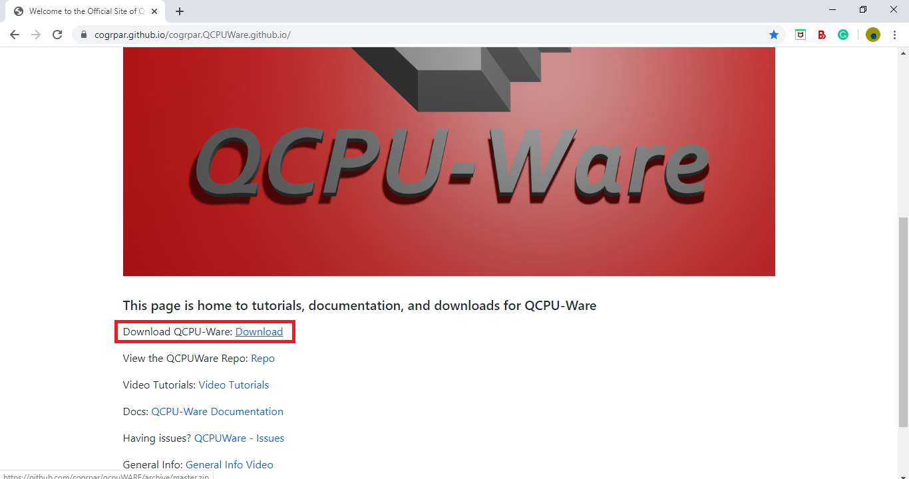

# Welcome to QCPU-Ware Documentation

## 1. Introduction
### 1.1 What is QCPU-Ware?
QCPU-Ware is software that allows users to solve problems on a quantum computer without needing to know anything about quantum computers.  QCPU-Ware is built on D-Wave Systems' Leap Ocean-SDK [D-Wave Leap](https://www.dwavesys.com/take-leap).  QCPU-Ware takes the Ocean-SDK and makes the entire development process much more user-friendly.  QCPU-Ware provides the user with simple and easy to use tools to formulate problems to be solved on the D-Wave quantum computers.  By using the QCPU-Ware Java library, users can define real-world problems to be solved on the D-Wave System like never before.  They can do all of this without needing to know anything about how quantum computing works.

### 1.2 What is a QCPU?
QCPU-Ware stands for "Quantum Converter Processing Unit softWare".  A Quantum Converter Processing Unit is a device that converts a problem specified by the user, into a problem that a quantum computer can solve.  The advantage of using a QCPU is that it allows the user to formulate problems without needing to know exactly how quantum computers work.  This also eliminates the need for the user to know how to formulate problems for the quantum computer.  This, in turn, makes coding on a quantum computer much easier, and available to people with any level of coding experience.   QCPU-Ware allows any Debian Linux based system (E.g. a [Raspberry Pi](https://www.raspberrypi.org/)) to be used as a QCPU.


## 2. How QCPU-Ware Works
### 2.1 QCPU
QCPU-Ware allows the user to set up a QCPU on any device running Debian based Linux (some popular debian based Linux distros are Ubuntu, Raspbian, Zorin os, and Kali Linux.  To get a complete list, see [Debian-based_distributions](https://en.wikipedia.org/wiki/Category:Debian-based_distributions)).  A QCPU can be set up on the same device that the QCPU-Ware Java Library is being used on, or it can be set up on a diferent device.  Both options are supported by QCPU-Ware, and it is the user's choice.  The device that the QCPU-Ware Java library is installed on is called the **primary device**.  When a QCPU is set up directly on the primary device, it is called an **internal QCPU**.  On the other hand, when a QCPU is set up on another external device, it is called an **external QCPU**.

### 2.2 Internal QCPU
Recall that QCPU-Ware only supports setting up QCPUs on devices running Debian based Linux.  If Debian based Linux is the main operating system on the primary device, then a QCPU can be set up directly on the device.  However, the primary device might not be running Debian based Linux as it's main os, as is often the case.  In this situation, an internal QCPU can still be set up, but inside of a Linux [virtual machine](https://en.wikipedia.org/wiki/Virtual_machine).

### 2.3 External QCPU
An external QCPU can be set up any any device running Debian based Linux, so long as it is connected to the same wifi network as the primary device.  There are many [single board computers](https://en.wikipedia.org/wiki/Single-board_computer) out there that are capable of running linux.  These computers are a great option for an external QCPU, because they are often very cheap.  The best option when it comes to single board external QCPUs is the [Raspberry Pi](https://www.raspberrypi.org/).

### 2.4 How QCPU-Ware Sets Up QCPUs to Handle Requests from the Java Library
When the QCPU-Ware QCPU setup script is run on a Linux device, it does 3 things:

**1.** It sets up an [Apache Webserver](https://httpd.apache.org) on the device, to which the Java library can send requests and access results.

**2.** It installs the QCPU software that alows the device to convert user formulated problems into problems that can be submitted to a quantum computer.  It also generates a script that makes the QCPU software run automatically when the device boots up.

**3.** It installs and sets up the D-Wave Ocean SDK on the device, allowing it to submit problems to a quantum computer and get the result back. 

Using the QCPU-Ware Java library, users specify the ip address of the QCPU.  This gives the primary device access to the QCPU's webserver, allowing it to submit problems and view the results.  Before they can submit problems to the QCPU, the user must formulate the problem using the Java library's built in problem formulation tools.  Once the problem has been formulated, the user can submit it to the QCPU using another built in function.  This function will send the problem as a request to the webserver.  A php script running on the webserver reformats the request and writes it to a file.  When the QCPU solvers detect that the file has been edited, it reads the contents of that file to get the problem.  The solver then converts the problem into a [binary quadratic model](https://docs.ocean.dwavesys.com/en/stable/concepts/bqm.html) (BQM), which is a type of function that can be minimized on a D-Wave quantum computer.  The problem is the  submitted to a quantum computer to be solved.  Once the QCPU gets the result back, it converts it back into the format used by the Java library, and writes it to a file on the webserver.  Once the Java library detects that the server has the solution, it reads the solution and presents it to the user.  This entire process takes mere seconds, and it greatly reduces the complexity of problem formulation on the user side.  The flow-chart below shows the process described above:


## 3. Installation and Setup
### 3.1 QCPU Setup
#### 3.1.1 Getting Started
Remember that whatever device you plan on using as your QCPU must be running Debian based Linux.  If you are going to be using an internal QCPU, and Linux is not your main operating system, you will need to set up a virtual machine.  These docs will not cover setting up a virtual machine, but you can see [this tutorial](https://brb.nci.nih.gov/seqtools/installUbuntu.html), or this [QCPU-Ware setup video](https://www.youtube.com/channel/UCNy6WfWTRKS4vya6KlD4Hxg) for more information.  If you plan on using an external QCPU, make sure that the external device has Debian based Linux set up on it.  If you are using a Raspberry Pi, see [this guide](https://www.raspberrypi.org/documentation/installation/installing-images/README.md) or the [QCPU-Ware setup video](https://www.youtube.com/channel/UCNy6WfWTRKS4vya6KlD4Hxg) for information on installing and setting up the operating system, [Raspbian](https://www.raspberrypi.org/documentation/raspbian/).

<iframe src="https://cogrpar.github.io/cogrpar.QCPUWare.github.io/imgs/Warning1.html" height="1600" width="1000" scrolling='yes' frameBorder="0" align="left" ></iframe>

QCPU-Ware includes a QCPU setup script that can be run on any Debian Linux device to set up a QCPU on that device.  Before you can clone the QCPU-Ware repository and run the setup script on a device, you need to make sure that the device has the proper tools installed to run the script.  The device will need [**git**](https://www.atlassian.com/git/tutorials/what-is-git) installed to clone the QCPU-Ware repository, and [**python3**](https://www.python.org/) (as well as [**python3-pip**](https://pip.pypa.io/en/stable/)) installed to run the script.  To install these programs, run this command on the device you will be using as your QCPU:
```
sudo apt-get update
sudo apt-get install git python3 python3-pip
```
When you run this command, the device will prompt you for the root password.  Some Debian Linux distros don't have a root password by default.  In that case, if you are promped for the root password, just type in the password of your current user.  For example, if you are using Ubuntu (which has no root password by default), and you are logged in as a user named "user" whose password is "password", you would type "password" when promped for the root password.  This will become important later when the setup script prompts you for the root password in order to run the QCPU-Ware QCPU solver scripts on boot.  For now, just make sure that the above command runs properly.  Once it has installed those tools, you should check that they have been installed successfully by running these 3 commands:
```
git --version
python3 --version
pip3 --version
```
If you get an output telling you the version for all three of these command, you are ready to move on.

#### 3.1.2 Cloning QCPU-Ware
There are two options for cloning the QCPU-Ware Github repository:

**1.** You can download the repo as a .zip file by clicking the "Download" button on the [QCPU-Ware Official Website](https://cogrpar.github.io/cogrpar.QCPUWare.github.io/):

Once the .zip file has finished downloading, extract the contents of the file to a directory that you can easily access.  You can do this through the File Viewer GUI, or by using this command:
```
unzip qcpuWARE-master.zip
```
Once the contents of the .zip file have been extracted, navigate into the new folder called "qcpuWARE-master" by using this command:
```
cd qcpuWARE-master
```

**2.** You can clone the repo directly using **git**.  To do that, navigate to the directory where you would like the repository to be cloned to, and run this command:
```
sudo git clone https://github.com/cogrpar/qcpuWARE.git
```
Once git has finished cloning the repo, navigate into the new direcory called "qcpuWARE" by using this command:
```
cd qcpuWARE
```

#### 3.1.2 Running the QCPU-Ware QCPU Setup Script


## 4. What Types of Problems Can You Solve With QCPU-Ware?


## 5. Connecting to Your QCPU


## 6. Solving Binary Constraint Satisfaction Problems


## 7. Solving For Function Extremes 
