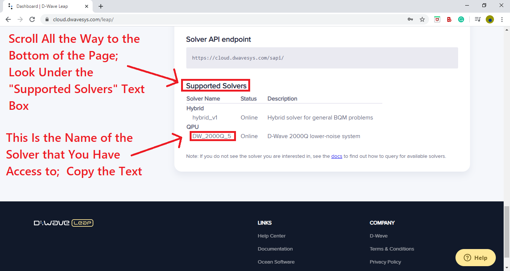

# Welcome to QCPU-Ware Documentation

## 1. Introduction
### 1.1 What is QCPU-Ware?
QCPU-Ware is software that allows users to solve problems on a quantum computer without needing to know anything about quantum computing.  QCPU-Ware is built on D-Wave Systems' Leap Ocean-SDK [D-Wave Leap](https://www.dwavesys.com/take-leap).  QCPU-Ware takes the Ocean-SDK and makes the entire development process much more user-friendly.  QCPU-Ware provides the user with simple and easy to use tools to formulate problems to be solved on the D-Wave quantum computers.  By using the QCPU-Ware Java library, users can define real-world problems to be solved on the D-Wave System like never before.  They can do all of this without needing to know anything about how quantum computing works.

### 1.2 What is a QCPU?
QCPU-Ware stands for "Quantum Converter Processing Unit softWare".  A Quantum Converter Processing Unit is a device that converts a problem specified by the user, into a problem that a quantum computer can solve.  The advantage of using a QCPU is that it allows the user to formulate problems without needing to know exactly how quantum computers work.  This also eliminates the need for the user to know how to formulate problems for the quantum computer.  This, in turn, makes coding on a quantum computer much easier, and available to people with any level of coding experience.   QCPU-Ware allows any Debian Linux based system (E.g. a [Raspberry Pi](https://www.raspberrypi.org/)) to be used as a QCPU.


## 2. How QCPU-Ware Works
### 2.1 QCPU
QCPU-Ware allows the user to set up a QCPU on any device running Debian based Linux (some popular debian based Linux distros are Ubuntu, Raspbian, Zorin os, and Kali Linux.  To get a complete list, see [Debian-based_distributions](https://en.wikipedia.org/wiki/Category:Debian-based_distributions)).  A QCPU can be set up on the same device that the QCPU-Ware Java Library is being used on, or it can be set up on a diferent device.  Both options are supported by QCPU-Ware, and it is the user's choice.  The device that the QCPU-Ware Java library is installed on is called the **primary device**.  When a QCPU is set up directly on the primary device, it is called an **internal QCPU**.  On the other hand, when a QCPU is set up on another external device, it is called an **external QCPU**.

### 2.2 Internal QCPU
Recall that QCPU-Ware only supports setting up QCPUs on devices running Debian based Linux.  If Debian based Linux is the main operating system on the primary device, then a QCPU can be set up directly on the device.  However, the primary device might not be running Debian based Linux as it's main os, as is often the case.  In this situation, an internal QCPU can still be set up, but inside of a Linux [virtual machine](https://en.wikipedia.org/wiki/Virtual_machine).

### 2.3 External QCPU
An external QCPU can be set up any any device running Debian based Linux, so long as it is connected to the same wifi network as the primary device.  There are many [single board computers](https://en.wikipedia.org/wiki/Single-board_computer) out there that are capable of running linux.  These computers are a great option for an external QCPU, because they are often very cheap.  The best option when it comes to single board external QCPUs is the [Raspberry Pi](https://www.raspberrypi.org/).

### 2.4 How QCPU-Ware Sets Up QCPUs to Handle Requests from the Java Library
When the QCPU-Ware QCPU setup script is run on a Linux device, it does 3 things:

**1.** It sets up an [Apache Webserver](https://httpd.apache.org) on the device, to which the Java library can send requests and access results.

**2.** It installs the QCPU software that alows the device to convert user formulated problems into problems that can be submitted to a quantum computer.  It also generates a script that makes the QCPU software run automatically when the device boots up.

**3.** It installs and sets up the D-Wave Ocean SDK on the device, allowing it to submit problems to a quantum computer and get the result back. 

Using the QCPU-Ware Java library, users specify the ip address of the QCPU.  This gives the primary device access to the QCPU's webserver, allowing it to submit problems and view the results.  Before they can submit problems to the QCPU, the user must formulate the problem using the Java library's built in problem formulation tools.  Once the problem has been formulated, the user can submit it to the QCPU using another built in function.  This function will send the problem as a request to the webserver.  A php script running on the webserver reformats the request and writes it to a file.  When the QCPU solvers detect that the file has been edited, it reads the contents of that file to get the problem.  The solver then converts the problem into a [binary quadratic model](https://docs.ocean.dwavesys.com/en/stable/concepts/bqm.html) (BQM), which is a type of function that can be minimized on a D-Wave quantum computer.  The problem is the  submitted to a quantum computer to be solved.  Once the QCPU gets the result back, it converts it back into the format used by the Java library, and writes it to a file on the webserver.  Once the Java library detects that the server has the solution, it reads the solution and presents it to the user.  This entire process takes mere seconds, and it greatly reduces the complexity of problem formulation on the user side.  The flow-chart below shows the process described above:


## 3. Installation and Setup
### 3.1 QCPU Setup
#### 3.1.1 Getting Started
Remember that whatever device you plan on using as your QCPU must be running Debian based Linux.  If you are going to be using an internal QCPU, and Linux is not your main operating system, you will need to set up a virtual machine.  These docs will not cover setting up a virtual machine, but you can see [this tutorial](https://brb.nci.nih.gov/seqtools/installUbuntu.html), or this [QCPU-Ware setup video](https://www.youtube.com/channel/UCNy6WfWTRKS4vya6KlD4Hxg) for more information.  If you plan on using an external QCPU, make sure that the external device has Debian based Linux set up on it.  If you are using a Raspberry Pi, see [this guide](https://www.raspberrypi.org/documentation/installation/installing-images/README.md) or the [QCPU-Ware setup video](https://www.youtube.com/channel/UCNy6WfWTRKS4vya6KlD4Hxg) for information on installing and setting up the operating system, [Raspbian](https://www.raspberrypi.org/documentation/raspbian/).

<iframe src="https://cogrpar.github.io/cogrpar.QCPUWare.github.io/imgs/Warning1.html" height="1600" width="1000" scrolling='yes' frameBorder="0" align="left" ></iframe>

QCPU-Ware includes a QCPU setup script that can be run on any Debian Linux device to set up a QCPU on that device.  Before you can clone the QCPU-Ware repository and run the setup script on a device, you need to make sure that the device has the proper tools installed to run the script.  The device will need [**git**](https://www.atlassian.com/git/tutorials/what-is-git) installed to clone the QCPU-Ware repository, and [**python3**](https://www.python.org/) (as well as [**python3-pip**](https://pip.pypa.io/en/stable/)) installed to run the script.  To install these programs, run this command on the device you will be using as your QCPU:
```
sudo apt-get update
sudo apt-get install git python3 python3-pip
```
When you run this command, the device will prompt you for the root password.  Some Debian Linux distros don't have a root password by default.  In that case, if you are promped for the root password, just type in the password of your current user.  For example, if you are using Ubuntu (which has no root password by default), and you are logged in as a user named "user" whose password is "password", you would type "password" when promped for the root password.  This will become important later when the setup script prompts you for the root password in order to run the QCPU-Ware QCPU solver scripts on boot.  For now, just make sure that the above command runs properly.  Once it has installed those tools, you should check that they have been installed successfully by running these 3 commands:
```
git --version
python3 --version
pip3 --version
```
If you get an output telling you the version for all three of these command, you are ready to move on.

#### 3.1.2 Cloning QCPU-Ware
There are two options for cloning the QCPU-Ware Github repository:

**1.** You can download the repo as a .zip file by clicking the "Download" button on the [QCPU-Ware Official Website](https://cogrpar.github.io/cogrpar.QCPUWare.github.io/):

Once the .zip file has finished downloading, extract the contents of the file to a directory that you can easily access.  You can do this through the File Viewer GUI, or by using this command:
```
unzip qcpuWARE-master.zip
```
Once the contents of the .zip file have been extracted, navigate into the new folder called "qcpuWARE-master" by using this command:
```
cd qcpuWARE-master
```

**2.** You can clone the repo directly using **git**.  To do that, navigate to the directory where you would like the repository to be cloned to, and run this command:
```
sudo git clone https://github.com/cogrpar/qcpuWARE.git
```
Once git has finished cloning the repo, navigate into the new direcory called "qcpuWARE" by using this command:
```
cd qcpuWARE
```

#### 3.1.2 Running the QCPU-Ware QCPU Setup Script
<iframe src="https://cogrpar.github.io/cogrpar.QCPUWare.github.io/imgs/Warning2.html" height="100" width="1000" scrolling='yes' frameBorder="0" align="left" ></iframe>

Once you have navigated into the repository directory ("qcpuWARE-master" if you downloaded the .zip file, and "qcpuWARE" if you used git), navigate into the "QCPU_Setup" directory by using this command:
```
cd QCPU_Setup
```
You can now execute the QCPU setup script using this command:
```
sudo python3 setup.py install
```
If you have already set up a QCPU on a device, and would like to update it, run the above command, but replace the "install" argument with an "update" argument.  If you are prompted for the root password, and you have a root password set up, then enter the root password and hit enter.  If you are prompted for the root password, and you do not have a root password, type in the password of the account that you are currently using and hit enter.  The setup script will start by installing an [Apache Webserver](https://httpd.apache.org) on your device (see [How QCPU-Ware Sets Up QCPUs to Handle Requests from the Java Library](https://cogrpar.github.io/cogrpar.QCPUWare.github.io/docs.html#24-how-qcpu-ware-sets-up-qcpus-to-handle-requests-from-the-java-library)).  If the script prompts you to give it permission to install the webserver, you must give it permission by typing "y" and then enter.  Next, the setup script will prompt you to create a password for the QCPU webserver:  
```
What would you like the server's password to be (optional): 
```
This is an optional setting, so you can either type in a password, or you can leave it blank and hit enter.  If you do set a password, you will need to use it in the QCPU-Ware Java library in order to access the QCPU.  Next, the setup script will prompt you for a username:
```
username:
```
This username should be the user that you are currently using, and the one that the "/home/(username)" directory is named after.  Type in your username and hit enter.  Next, you will be asked if you are using an ARM based device (which is often the case if you are using a single-board external QCPU, i.e. a Raspberry Pi):
```
Are you using a raspberry pi or other device with similar architecture (ARM based)? (y = yes, n = no):
```
The setup script needs this information in order to know how to install the [D-Wave Ocean SDK](https://github.com/dwavesystems/dwave-ocean-sdk) on your QCPU.  In order to install the SDK on an ARM based device, it must build the SDK directly on the device, whereas on other architectures, it can simply use [python3-pip](https://pip.pypa.io/en/stable/).  If you are using an ARM based device, type "y" into this field.  Otherwise, type "n".  Hit enter.  Next, the script will ask for your root password:
```
root password:
```
It needs the root password to tell the QCPU to start the QCPU-Ware solvers automatically when the device boots up.  As mentioned earlier, if you have no root password on your device, type in the password of the user that you are currently using.  For example, if you are using Ubuntu (which has no root password by default), and you are logged in as a user named "user" whose password is "password", you would type "password" when promped for the root password.  If you do have a root password, type it in and hit enter.  The setup script has now finished installing the QCPU-Ware QCPU solvers on your QCPU.  Now, the only thing that it needs to do, is to gather your D-Wave Leap account information on the QCPU.  It needs this info to access the quantum computers.  When the script does this, it will prompt you for all of your account information.  It stores this infomation using the ```dwave config create``` command built into the D-Wave Ocean SDK.  The instructions for how to fill out the fields for this command are below, but you can get more information in the [the D-Wave Docs](https://docs.ocean.dwavesys.com/en/stable/overview/sapi.html).  You should see the following text once the setup script is ready to start asking for your D-Wave Leap account information:
```
Time to input your dwave leap account info; if you are not sure how to fill out these fields, please refer to https://docs.ocean.dwavesys.com/en/stable/overview/sapi.html
Configuration file not found; the default location is: /home/(user)/.config/dwave/dwave.conf
Confirm configuration file path [/home/(user)/.config/dwave/dwave.conf]:
```
This is asking you where you would like it to store the configuration file contaning your D-Wave Leap account information.  Leave the setting as default by hitting enter.  Next, you should this:
```
Profile (create new) [prod]:
```
Once again, you will want to leave this as default, so just hit enter.  Next, you should see this:
```
API endpoint URL [skip]:
```
This is asking for the API endpoint URL to access the D-Wave system.  Use this url: ```https://cloud.dwavesys.com/sapi```.  Once you have coppied the url in, hit enter.  You should now see this:
```
Authentication token [skip]:
```
Each D-Wave Leap account has a unique authentication token generated for it.  By using your account authentucation token, the QCPU can access the quantum computers with your Leap account, without needing to store your account username or password.  To get your authentication token, you will want to go to your [D-Wave Leap Account Dashboard](https://cloud.dwavesys.com/leap/).  Log in with your Leap account, and scroll until you see a text box on the left side of the screen that says: "API Token"; click on the "copy" button to copy the token to your clipboard:

Once you have copied the token to your clipboard, paste it into the setup script terminal window.  Once you have input your API token into the setup script, hit enter.  Next, you should see this:
```
Default client class (qpu or sw) [qpu]:
```
You will want to leave this setting as default, so hit enter.  Next, you should see this:
```
Default solver [skip]:
```
This is the setting that the QCPU will use to determine what device it will send the problems to.  You will need to type in the name of the quantum computer that your D-Wave Leap account has access to.  To get the name of this solver, go back to your [D-Wave Leap Account Dashboard](https://cloud.dwavesys.com/leap/).  Scroll all the way to the bottom, untill you see the text box that says "Supported Solvers"; look under "Solvers", and under "QPU".  This is the name of the quantum computer that you have access to:

Copy this solver name, and paste it into the setup script terminal window.  Once you have inserted the solver name, hit enter.  The setup script now has all of the information it needs to access a D-Wave quantum computer.  Your configuration should be saved, and you should see:
```
Configuration saved.
```
The last thing that the setup script will do, is ping the D-Wave quantum computer using the ```dwave ping``` command.  If the ping is successful, you should see an output similar to this:
```
Using endpoint: https://cloud.dwavesys.com/sapi
Using solver: (your solver name)
Submitted problem ID: 874c2706-0edb-4627-bc6f-b5c6d94dc0f7

Wall clock time:
 * Solver definition fetch: 659.668 ms
 * Problem submit and results fetch: 1877.596 ms
 * Total: 2537.264 ms

QPU timing:
 * qpu_sampling_time = 315 us
 * qpu_anneal_time_per_sample = 20 us
 * qpu_readout_time_per_sample = 274 us
 * qpu_access_time = 9696 us
 * qpu_access_overhead_time = 1896 us
 * qpu_programming_time = 9382 us
 * qpu_delay_time_per_sample = 21 us
 * total_post_processing_time = 54 us
 * post_processing_overhead_time = 54 us
 * total_real_time = 9696 us
 * run_time_chip = 315 us
 * anneal_time_per_run = 20 us
 * readout_time_per_run = 274 us
setup complete
```
If you get this output, the setup script has completed successfully, and you are ready to start using your QCPU!  Your QCPU should now be set up to start running the QCPU-Ware QCPU solvers whenever it boots up.  For more information on connecting to your QCPU using the Java library, see [Connecting to Your QCPU](https://cogrpar.github.io/cogrpar.QCPUWare.github.io/docs.html#5-connecting-to-your-qcpu).

### 3.2 Installing the QCPU-Ware Java Library

In order to install the QCPU-Ware Java library on your primary device, you will need to clone the QCPU-Ware github repo on the primary device.  Once again, here are the two options for cloning the QCPU-Ware Github repository:

**1.** You can download the repo as a .zip file by clicking the "Download" button on the [QCPU-Ware Official Website](https://cogrpar.github.io/cogrpar.QCPUWare.github.io/):

Once the .zip file has finished downloading, extract the contents of the file to a directory that you can easily access.  Once the contents of the .zip file have been extracted, navigate into the new folder called "qcpuWARE-master", either in a file viewer GUI, or by using this command:
```
cd qcpuWARE-master
```

**2.** You can clone the repo directly using **git** (of course if you decide to use this method, you must make sure that git is installed on your primary device.  You can acces the download page [here](https://git-scm.com/downloads)).  To do that, navigate to the directory where you would like the repository to be cloned to, and run this command:
```
git clone https://github.com/cogrpar/qcpuWARE.git
```
Once git has finished cloning the repo, navigate into the new direcory called "qcpuWARE", either in a file viewer GUI, or by using this command:
```
cd qcpuWARE
```
Once the repository is cloned on the primary device, navigate into the directory containing the Java library, either in a file viewer GUI, or by using this command:
```
cd JavaLibrary
```
Inside of this directory, you should see the Java library as both a .jar file, and as a .java file: 


Some Java IDEs, such as [Eclipse](https://www.eclipse.org/eclipseide/) have the option to add a Java library in the form of a .jar file.  If you are using an IDE that supports this,  you can use that option to add the QCPU-Ware Java library .jar file to your project.  See [this](https://www.java67.com/2017/04/how-to-add-jar-file-in-eclipse-project.html) tutorial for adding .jar files to Eclipse projects.  If you are using an IDE that does not support adding external .jar files, or if you are not using an IDE, you can either manually add the .jar file to the Java classpath (see [this](https://howtodoinjava.com/java/basics/java-classpath/) tutorial), or you can just copy the .java file into your project directory.  Once you have added the QCPU-Ware Java library to your project using one of the above methods, you can test to make sure that you can use it in your code by creating a new instance of the library in your main method.  For example, if your project class is called "myClass", then your code should look like this:
``` java
//import statement up here if needed (see https://www.geeksforgeeks.org/packages-in-java/ for more info about "import" in java)

class myClass{
  //main method
  public static void Main (String[] args){
    //create a new instance of the qcpuWare Java library and call it qcpu:
    qcpuWare qcpu = new qcpuWare();
  }
}
```
If you can run this code without errors, then the QCPU-Ware Java library is set up on your primary device, and you are ready to start solving problems using QCPU-Ware.


## 4. What Types of Problems Can You Solve With QCPU-Ware?
QCPU-Ware can be used to submit problems to a D-Wave quantum computer to be solved.  D-Wave quantum computers are a special kind of quantum computer called a [**Quantum Annealer**](https://docs.dwavesys.com/docs/latest/c_gs_2.html).  You can learn more about quantum annealing in the D-Wave system documentation, or you can watch [this video](https://www.youtube.com/watch?v=zvfkXjzzYOo) which sums the process up pretty well.  The only information about quantum annealing that is important for using QCPU-Ware is how quantum annealers solve problems.

### 4.1 How Quantum Annealers Work, and How They Solve Problems
Quantum annealers, like the ones built by D-Wave (the ones used by QCPU-Ware), are a special kind of quantum computer.  They are simpler than an ordinary [universal quantum computer](https://www.youtube.com/watch?v=2B680d-qvhI&t=24s), and that makes them easier to create in the real world.  Quantum annealers take advantage of a fundamental law of nature: a system will always collapse into the lowest energy state.  Essentially, a quantum annealer encodes a problem onto a set of q-bits and then lets the q-bits collapse into the lowest possible energy state.  In this way, a quantum annealer can find the smallest possible configuration of all of the variables in the problem.  This is useful because it allows quantum annealers to solve problems known as  [**optimization problems**](https://en.wikipedia.org/wiki/Optimization_problem).  Optimization problems are problems that involve many different variables, and the goal is to find the configuration of all of the variables that makes the result as big or as small as possible.  For example, imagine this scenario: a person is going house to house to sell some form of food for a fundraiser.  Every house will buy a different quantity of the food item, and each house will take a certain amount of time to get to.  The person wants to know what houses they should go to, to sell all of the food items as fast as possible, considering both how long it takes to get to each house, and how much each house will purchase.  In this example, solving the optimization problem means finding the configuration of the variables (which houses should be visited) which will minimize the amount of time that it would take to sell all of the food (or if you want to look at it as a maximization problem, the goal would be to maximize efficiency).  Optimization problems show up all of the time in computer science and beyond.  Being able to solve them is extremely useful, but for classical computers, it is extremely difficult.  That is because classical computers must go through every single configuration of the variables to see if it is the best possible configuration.  For problems with many variables, there are essentially an infinite number of possible configurations (at least the number is too great for a classical computer to check in any realistic amount of time), which means that classical computers can't solve most reasonable complex optimization problems.  Quantum annealers, however, are quite efficient at solving optimization problems.  By encoding the problem on a set of q-bits, the annealer can let the q-bits naturally collapse into the lowest energy state, which corresponds to the optimal configuration of all of the variables.  This allows quantum annealers to solve optimization problems much faster than classical computers.

### 4.2 Optimization Problems that Can be Submitted Through QCPU-Ware
QCPU-Ware uses the quantum annealers built by D-Wave Systems to solve optimization problems.  These quantum annealers have up to 5000 q-bits, but the technology is still in its early stages.  Even so, QCPU-Ware can be used to easily define and solve fairly complex and useful optimization problems on the quantum computers.  As of right now, QCPU-Ware has built-in tools to solve two kinds of optimization problems.

**1.  Binary Constraint Satisfaction Problems (BCSP):**

The first kind of optimization problem that can be solved with QCPU-Ware is **binary constraint satisfaction problems** or **BCSPs**.  As the name suggests, BCSPs are problems that involve binary variables, meaning that they can be in one of two states: 0 or 1.  These variables can be used to represent real-life situations that can be in one of two states.  For example, a variable could be used to store whether a person is a male or female, if a store is open or closed, or if it is day or night.  Binary constraint satisfaction problems are defined by specifying one or more constraints about the set of binary variables.  These constraints can involve any number of variables, and they place limits on what states that the variables can be in, and what states they can be in with relation to each other.  For example, there could be a constraint saying: "If it is night, then the store is closed".  Once all of the constraints have been specified, the goal is to find the configuration of all of the binary variables that satisfy as many of the constraints as possible.  This is how the BCSP is solved.  In our example with the two variables (day/night and store open/closed), and with the single constraint ("If it is night, then the store is closed"), then the two possible solutions to the BCSP: "day and open", or "night and closed".  This boolean truth table represents the example BCSP:

BCSPs with many variables are extremely difficult to solve on a classical computer, but they can be solved using QCPU-Ware.  To learn more about BCSPs, see the [D-Wave docs](https://docs.ocean.dwavesys.com/en/stable/examples/scheduling.html)

**2.  Function Extremes:** 

The second kind of optimization problem that can be solved with QCPU-Ware is called **function extremes**.  Imagine that you have an n-dimensional function, f(x1, x2, ... xn).  This function can model anything and the variables can be any value within a given domain.  Solving for the function extremes of f(x1, x2, ... xn) means solving for the configuration of all of the variable that yields the maximum or minimum value of the function.  For example, if f models cost, and it is based on variables like the number of employees, the salary of each employee, and such, then finding the minimum function extreme of f would correspond to finding the lowest cost in our situation.  If f(x1, x2, ... xn) makes a curve in (n+1)-dimensional space, then solving the function extreme means finding the point on the curve with the highest or lowest altitude:

There are many useful applications for finding the function extremes of various types of functions, and QCPU-Ware gives you the ability to solve for those function extremes.

## 5. Connecting to Your QCPU


## 6. Solving Binary Constraint Satisfaction Problems


## 7. Solving For Function Extremes 
